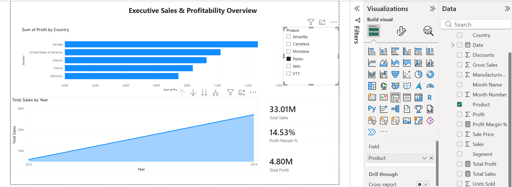

# Executive Sales and Profitability Analysis

## Overview
This project analyzes sales performance and profitability for a global manufacturing company across five countries. The primary goal was to transform raw sales records into an interactive Power BI dashboard that helps identify top-performing regions, key product margins, and growth trends over time.

## Dashboard Preview

## Tools & Technical Workflow
* **Data Prep (Power Query):** Cleaned raw transactional data, set proper data types (converted `Units Sold` to whole numbers), and removed unused columns to keep the file lightweight.
* **DAX Calculations:** Built custom DAX measures for primary KPIs instead of relying on default implicit aggregations. Used `DIVIDE` to calculate percentages safely.
  * `Total Sales = SUM(financials[Sales])`
  * `Total Profit = SUM(financials[Profit])`
  * `Profit Margin % = DIVIDE([Total Profit], [Total Sales], 0)`
* **Reporting & Design:** Created an interactive single-page view featuring high-level KPI cards, cross-filtering bar charts by country, line charts for monthly trends, and product slicers for dynamic filtering.

## Business Findings
* **Top Country:** France generated the highest total profit across all operational regions.
* **Product Insights:** Product lines show varying margin performance. For instance, the Paseo line generated $7.61M in total sales with a 16.62% profit margin.
* **Revenue Trend:** Year-over-year sales showed steady growth from 2013 into 2014.

## Project Structure
* `Sales_Performance_Dashboard.pbix` - Power BI file containing the data model, DAX measures, and dashboard design.
* `dashboard_screenshot.png` - Preview image of the dashboard interface.
