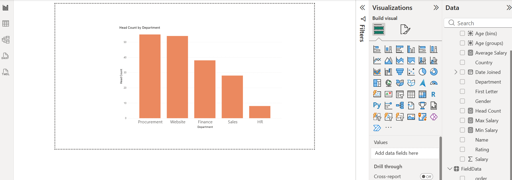
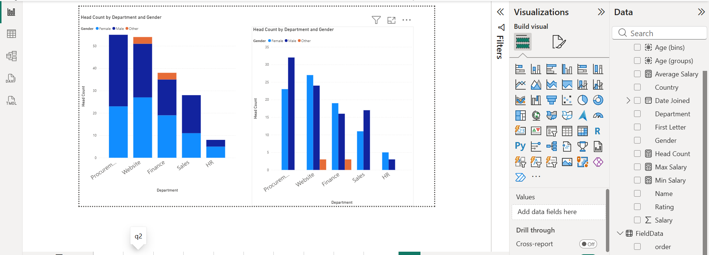
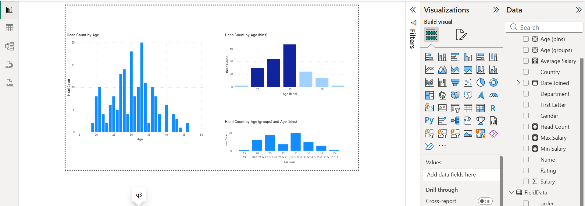
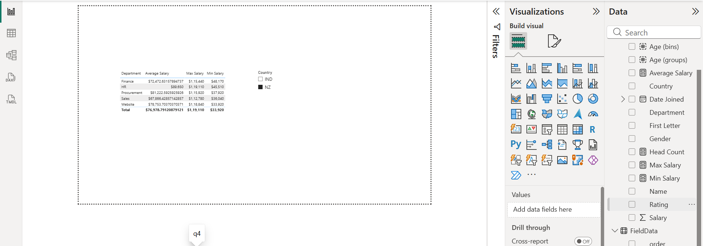
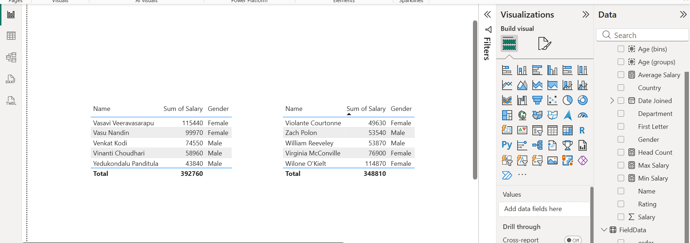
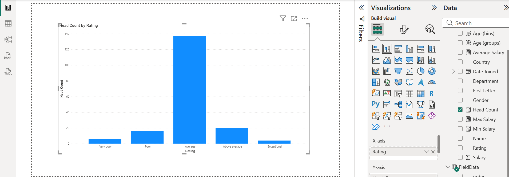
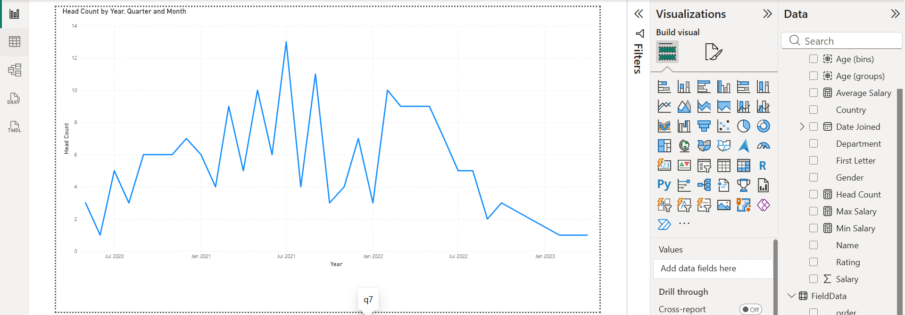
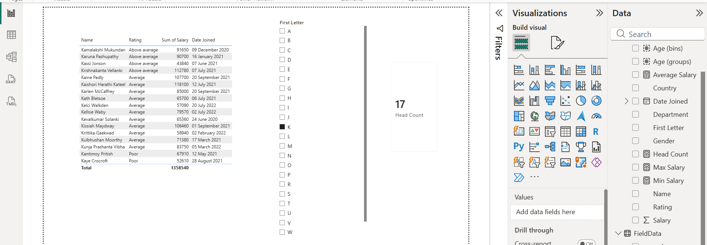
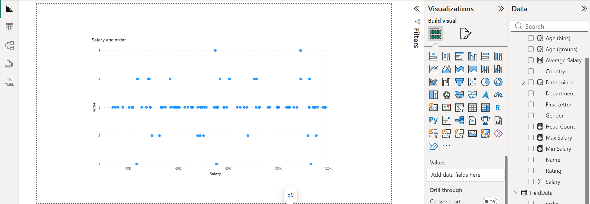
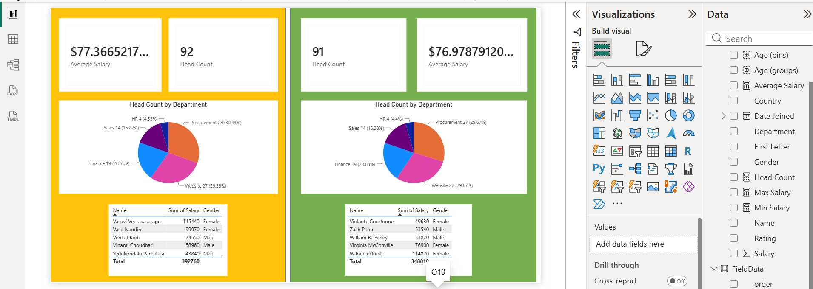

# 📊 HR Analytics Dashboard | Power BI Project

## 📋 Project Overview
This project presents an interactive HR Analytics Dashboard built using **Microsoft Power BI**. The dashboard analyzes employee demographics, compensation structures, performance distributions, and company growth trends to help business leaders make data-driven workforce decisions.

---

## 🛠️ Skills & Technologies Demonstrated
* **Power Query:** Data cleaning, type conversion, splitting columns with delimiters, and transforming raw text datasets.
* **Data Modeling:** Designed star-schema relationships across multiple dimension tables.
* **DAX & Calculations:** Created custom measures, calculated columns, age grouping, and data binning.
* **Data Visualization & Storytelling:** Clustered/stacked bar charts, scatter plots, KPI scorecards, conditional formatting, dynamic (FX) coloring, and Top N analysis.

---

## 💡 Business Questions Answered & Dashboard Visuals

### 1. How many employees are in each department?

### 2. What is the gender distribution across departments?

### 3. What is the age distribution of employees?

### 4. What are the minimum, maximum, and average salaries by department?

### 5. Who are the top earners in each country?

### 6. How is employee performance distributed?

### 7. How has the company grown over time?

### 8. Can employees be filtered by the starting letter of their names?

### 9. Is there a relationship between salary and performance?

### 10. How do India and New Zealand compare through a quick HR scorecard?

---

## 🚀 Key Takeaways & Learnings
* Developed advanced Power Query skills to handle non-standard text formatting.
* Mastered conditional formatting and Top N filters to highlight executive metrics quickly.
* Improved dashboard usability through custom slicers and clear, interactive visuals.
